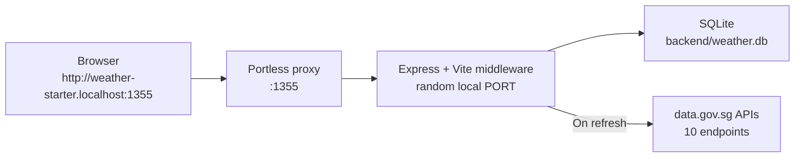

# Weather Starter

A full-stack Singapore weather dashboard built with Node/Express, React/Vite, and Tailwind CSS. It fetches live data from the Singapore government's [data.gov.sg](https://data.gov.sg) APIs and displays current conditions, forecasts, and environmental readings for any coordinate within Singapore.

   

## What It Shows

Each saved location displays a full weather dashboard:

| Card | Data | Source endpoint |
|---|---|---|
| **Condition** | 2-hour area forecast text + valid period | `/two-hr-forecast` |
| **Temperature** | Real-time °C from nearest weather station | `/air-temperature` |
| **Humidity** | Real-time % from nearest weather station | `/relative-humidity` |
| **Rainfall** | Real-time mm from nearest weather station | `/rainfall` |
| **Wind** | Speed (km/h) + compass direction | `/wind-speed` + `/wind-direction` |
| **UV Index** | Nationwide UVI reading (7am–7pm) | `/uv` |
| **Air Quality** | PSI (24-hr) + PM2.5 (1-hr) by nearest region | `/psi` + `/pm25` |
| **Forecast High** | Today's high from the 24-hr forecast | `/twenty-four-hr-forecast` |
| **Hourly Strip** | 6-hourly condition periods for the day | `/twenty-four-hr-forecast` |
| **4-Day Forecast** | Daily high/low temps + outlook text | `/4-day-weather-forecast` |

## Tech Stack

| Layer | Tools |
|---|---|
| Backend | Node.js 24, TypeScript, Express |
| Frontend | React 18, Vite 7, Tailwind CSS 3, Leaflet / React Leaflet (map card) |
| Database | SQLite via Drizzle ORM (`backend/weather.db`) |
| Dev URL | [Portless](https://portless.dev) named `.localhost` URL |
| External APIs | data.gov.sg (`api-open.data.gov.sg`, `api.data.gov.sg`) |

## Architecture



The backend and frontend run as **one Node process** in development. Express serves `/api/*` routes and Vite middleware serves the React app. The frontend uses relative `/api` requests — no port configuration needed.

Weather data is fetched on-demand (when a location is created or refreshed) and cached in SQLite. The UI reads from the local cache, so the page loads instantly without hitting the external API.

## Quick Start

**Prerequisites:** Node.js 24+, npm 10+

```bash
# Install all dependencies (root + workspaces)
npm install

# Start the dev server
npm run dev
```

Open the URL printed by Portless — usually:

```
http://weather-starter.localhost:1355
```

Or use the direct local URL (port varies each run, check terminal output):

```
http://127.0.0.1:<PORT>
```

> **Windows / Node 24 note:** The dev server passes `--use-system-ca` automatically so Node can verify data.gov.sg's TLS certificate against the Windows certificate store. No manual setup needed.

### Optional: API Key

Without an API key, data.gov.sg applies rate limits. The app handles this by serialising station reads and retrying on HTTP 429. For heavy use, get a free key at [data.gov.sg](https://data.gov.sg) and add it to a `.env` file:

```bash
# .env (copy from .env.example)
WEATHER_API_KEY=your_key_here
```

## Useful Commands

```bash
npm run dev          # Start Express + Vite through Portless
npm run build        # Build frontend and compile backend TypeScript
npm run start        # Run the compiled production server
npm test             # Run backend API tests (single run)
npm run test:watch   # Run backend API tests in watch mode
npm run doctor       # Verify /health and /api/locations are responding
npm run reset        # Delete the local SQLite database
npm run db:generate  # Generate Drizzle migrations after schema changes
npm run db:migrate   # Apply Drizzle migrations to backend/weather.db
```

## API Endpoints

| Method | Endpoint | Description |
|---|---|---|
| `GET` | `/health` | Health check |
| `GET` | `/api/locations` | List all saved locations with cached weather |
| `POST` | `/api/locations` | Add a location and immediately fetch weather |
| `GET` | `/api/locations/:id` | Get a single location |
| `POST` | `/api/locations/:id/refresh` | Re-fetch live weather from data.gov.sg |
| `DELETE` | `/api/locations/:id` | Remove a saved location |

**Add a location** (coordinates must be within Singapore):

```bash
curl -s -X POST http://127.0.0.1:<PORT>/api/locations \
  -H "Content-Type: application/json" \
  -d '{"latitude": 1.35, "longitude": 103.85}'
```

**Refresh weather:**

```bash
curl -s -X POST http://127.0.0.1:<PORT>/api/locations/1/refresh
```

## Data Flow

```
User clicks Refresh
       │
       ▼
POST /api/locations/:id/refresh
       │
       ▼
SingaporeWeatherClient.getCurrentWeather(lat, lon)
       │
       ├── two-hr-forecast          → condition, area, valid_period_text
       ├── twenty-four-hr-forecast  → forecast_low/high_c, forecast_periods
       ├── 4-day-weather-forecast   → daily_forecast[]
       ├── uv                       → uv_index
       ├── psi + pm25               → psi_twenty_four_hourly, pm25_one_hourly
       └── [sequential]
           ├── air-temperature      → temperature_c
           ├── relative-humidity    → humidity_percent
           ├── rainfall             → rainfall_mm
           ├── wind-speed           → wind_speed_knots
           └── wind-direction       → wind_direction_degrees
       │
       ▼
updateWeather(id, snapshot) → SQLite
       │
       ▼
Return updated LocationRecord → frontend state → UI re-render
```

Station-based endpoints (temperature, humidity, rainfall, wind) are fetched sequentially to avoid rate limits on the unauthenticated tier. Each HTTP 429 response is automatically retried up to 3 times with 1s/2s/3s backoff. All other endpoints run in parallel.

## Project Structure

```
AIxTech-projects/
├── backend/
│   ├── drizzle/                    # Generated SQL migrations
│   ├── src/
│   │   ├── server.ts               # Express app factory + Vite middleware
│   │   ├── db.ts                   # SQLite connection, Drizzle ORM helpers
│   │   ├── schema.ts               # Drizzle table definitions
│   │   ├── weather.ts              # SingaporeWeatherClient (all API calls)
│   │   ├── logger.ts               # Pino structured logger
│   │   └── routes/
│   │       ├── locations.ts        # REST endpoints for locations
│   │       └── locations.test.ts   # API integration tests
│   ├── package.json
│   └── tsconfig.json
├── frontend/
│   └── src/
│       ├── App.tsx
│       ├── main.tsx
│       ├── api.ts                  # fetch wrappers for /api/*
│       ├── types.ts                # Shared TypeScript interfaces
│       ├── state/
│       │   ├── store.tsx           # React context state store
│       │   └── theme.tsx           # Theme selection state, persisted to localStorage
│       └── components/
│           ├── Layout.tsx          # App shell
│           ├── Sidebar.tsx         # Location list panel
│           ├── SidebarCard.tsx     # Per-location summary card
│           ├── Hero.tsx            # Main weather display
│           ├── HourlyStrip.tsx     # 6-hourly forecast strip
│           ├── TenDayForecast.tsx  # 4-day forecast list
│           ├── Tiles.tsx           # Dashboard metric tiles
│           ├── MapCard.tsx         # Dashboard map card + fullscreen map view
│           ├── ThemeSelector.tsx   # Top-right theme dropdown
│           ├── AddLocationForm.tsx # Add location form
│           ├── format.ts           # Date/temp formatting helpers
│           └── icons.tsx           # SVG icon components
├── scripts/
│   ├── dev.mjs                     # Dev server launcher (Portless + tsx watch)
│   ├── start.mjs                   # Production server launcher
│   ├── doctor.mjs                  # Health check script
│   └── reset.mjs                   # Database reset script
├── drizzle.config.ts
├── .env.example
└── package.json                    # Root workspace (frontend + backend)
```

## External API Reference

Base URL: `https://api-open.data.gov.sg` (v2) · `https://api.data.gov.sg` (v1 legacy)

All endpoints are free. An optional `x-api-key` header raises rate limits.

| Endpoint | Used for | Update frequency |
|---|---|---|
| `GET /v2/real-time/api/two-hr-forecast` | Condition text, area name | Every 30 min |
| `GET /v2/real-time/api/air-temperature` | Temperature (nearest station) | ~1 min |
| `GET /v2/real-time/api/relative-humidity` | Humidity (nearest station) | ~1 min |
| `GET /v2/real-time/api/rainfall` | Rainfall (nearest station) | ~1 min |
| `GET /v2/real-time/api/wind-speed` | Wind speed (nearest station) | ~1 min |
| `GET /v2/real-time/api/wind-direction` | Wind direction (nearest station) | ~1 min |
| `GET /v2/real-time/api/uv` | UV index (nationwide) | Hourly, 7am–7pm |
| `GET /v2/real-time/api/psi` | PSI by region | Hourly |
| `GET /v2/real-time/api/pm25` | PM2.5 by region | Hourly |
| `GET /v2/real-time/api/twenty-four-hr-forecast` | H/L temps, 6-hourly periods | ~30 min |
| `GET /v1/environment/4-day-weather-forecast` | 4-day outlook | Twice daily |

## Feature Tasks

These tasks are ordered from easiest to hardest. Each builds on the existing codebase and introduces new concepts progressively.

### 1. Delete a location ✅

Add a `DELETE /api/locations/:id` endpoint and a delete button to each sidebar card.

<details>
<summary>Implementation notes</summary>

**Backend** — `deleteLocation(id)` added to `db.ts`. The Express router received `DELETE /api/locations/:id` returning `204` on success, `404` if not found, `422` for invalid IDs.

**Frontend** — `deleteLocation` added to `api.ts`. The state store received a `remove` action with optimistic UI (removes from local state immediately, without waiting for the server). If the deleted location was selected, selection moves to the next one automatically.

**UI** — A small `×` button sits in the top-right of each `SidebarCard`. The click event stops propagation so it doesn't also trigger card selection. While the delete is in-flight, the `×` swaps for a spinner.

</details>

### 2. Weather metrics tiles ✅

Display real-time temperature, humidity, rainfall, wind, UV index, and air quality in a tile grid below the forecast.

<details>
<summary>Implementation notes</summary>

**Backend** — `SingaporeWeatherClient.getCurrentWeather` was extended to fan out calls to all 10 metric endpoints. Station-based endpoints are serialised to avoid rate limits on the unauthenticated tier. Region-based endpoints (PSI, PM2.5) use the nearest region by Euclidean distance. `fetchJson` retries on HTTP 429 with 1s/2s/3s backoff. `--use-system-ca` was added to `scripts/dev.mjs` to resolve TLS verification failures on Windows with Node 24.

**Frontend** — `TileGrid` in `Tiles.tsx` renders eight tiles: `ConditionTile`, `AirQualityTile`, `WindTile` (with compass), `UVTile`, `TemperatureTile`, `PrecipitationTile`, `HumidityTile`, and `AveragesTile`. Each reads directly from `WeatherSnapshot` in local state.

</details>

### 3. Condition card ✅

A dedicated condition tile showing the 2-hour forecast text, area name, and valid period — with a condition-based icon and accent colour.

<details>
<summary>Implementation notes</summary>

`ConditionTile` added to `Tiles.tsx`. `conditionStyle()` maps forecast text to an icon and Tailwind accent colour: thundery → yellow, rain/showers → sky blue, night/overcast → indigo, fair/sunny → amber, default → white cloud. No new API calls — data comes from the existing `two-hr-forecast` snapshot.

</details>

### 4. Geolocation + auto-detect

Add a "Use my location" button that detects the user's position and adds the nearest Singapore area automatically.

| Layer | What to do |
|---|---|
| Frontend | New button in `AddLocationForm.tsx` using `navigator.geolocation` |

### 5. Singapore area picker

Replace manual lat/lon inputs with a searchable dropdown populated from `area_metadata` in the 2-hour forecast response.

| Layer | What to do |
|---|---|
| Backend | Expose `GET /api/areas` returning the area list |
| Frontend | Searchable combobox in `AddLocationForm.tsx` |

### 6. Location detail page with charts

Add a detail view showing historical readings over time as line charts.

| Layer | What to do |
|---|---|
| Backend | Store each refresh as a separate row instead of overwriting the snapshot |
| Frontend | New route + charts using Recharts or Chart.js |
| Packages | `react-router-dom`, `recharts` |

### 7. Multi-location management

Support drag-to-reorder, a pinned primary location, and swipe gestures on mobile.

| Layer | What to do |
|---|---|
| Backend | Persist sort order and primary flag |
| Frontend | Drag-and-drop sidebar, swipeable cards on mobile |

### 8. Map card and theme selector ✅

An Apple Weather-style map card on the dashboard, plus a theme selector in the top right.

<details>
<summary>Implementation notes</summary>

**Map card** — `leaflet` and `react-leaflet` were already listed as dependencies but unused anywhere in the codebase. `MapCard.tsx` wires them up: every saved location renders as a custom `L.divIcon` pin (a temperature pill above a dot, not the Leaflet default marker — sidesteps the default-marker-breaks-under-Vite issue entirely). Clicking a pin calls the same `select(id)` action the sidebar uses, so pin selection, the sidebar highlight, and the Hero detail view stay in sync through the existing store. The card renders a real map with panning/zooming disabled (pins stay clickable without hijacking page scroll); clicking the card or its "Expand" button opens a fullscreen `MapContainer` via a `createPortal` overlay, with full pan/zoom, Escape-to-close, and a close button. Tiles come from CARTO's free Voyager basemap. Locations can only be added through the existing "Add Location" flow — nothing on the map creates one.

**Theme selector** — `state/theme.tsx` adds a `ThemeProvider`/`useTheme()` context, mirroring the existing `state/store.tsx` pattern, that tracks the selected theme, persists it to `localStorage`, and sets a `data-theme` attribute on `<html>`. `ThemeSelector.tsx` is a small dropdown pinned to the top right. Three themes are registered: `apple` (the original look, unchanged), `aurora-glass` (deep indigo/violet gradient with sky-blue accents and wider letter-spacing), and `nordic-frost` (icy Scandinavian minimal — near-white ice-blue gradient with dark slate text, a full light-theme inversion of every white/black utility class). Themes are layered in purely through scoped CSS in `index.css` (`[data-theme="..."] { ... }`), so adding another is just a new CSS block plus a `THEMES` registry entry — no component changes required. See `THEMES.md` for specs on all implemented and planned themes.

</details>
