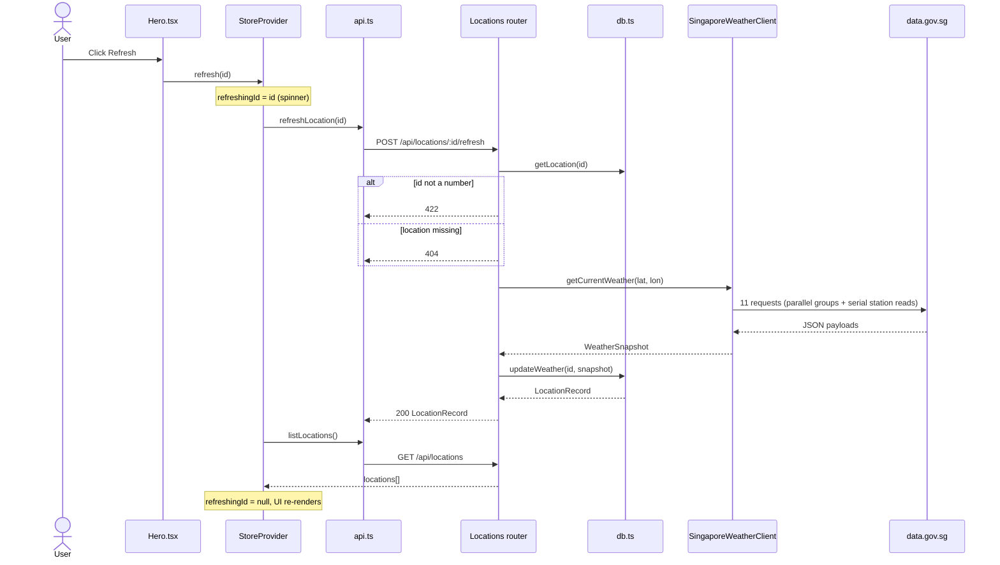
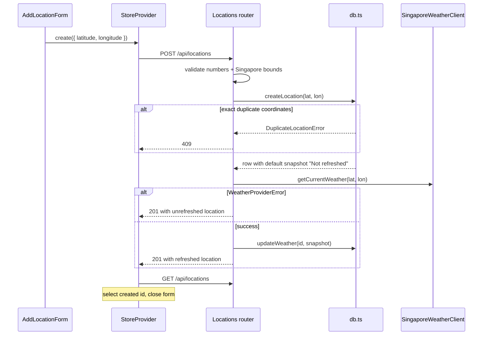
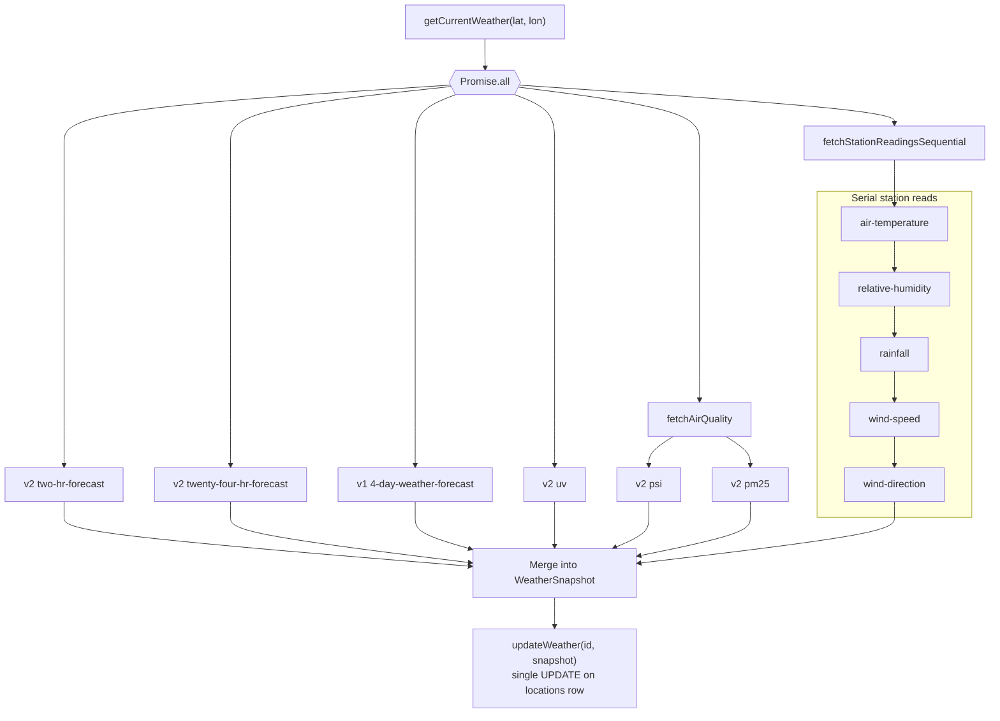
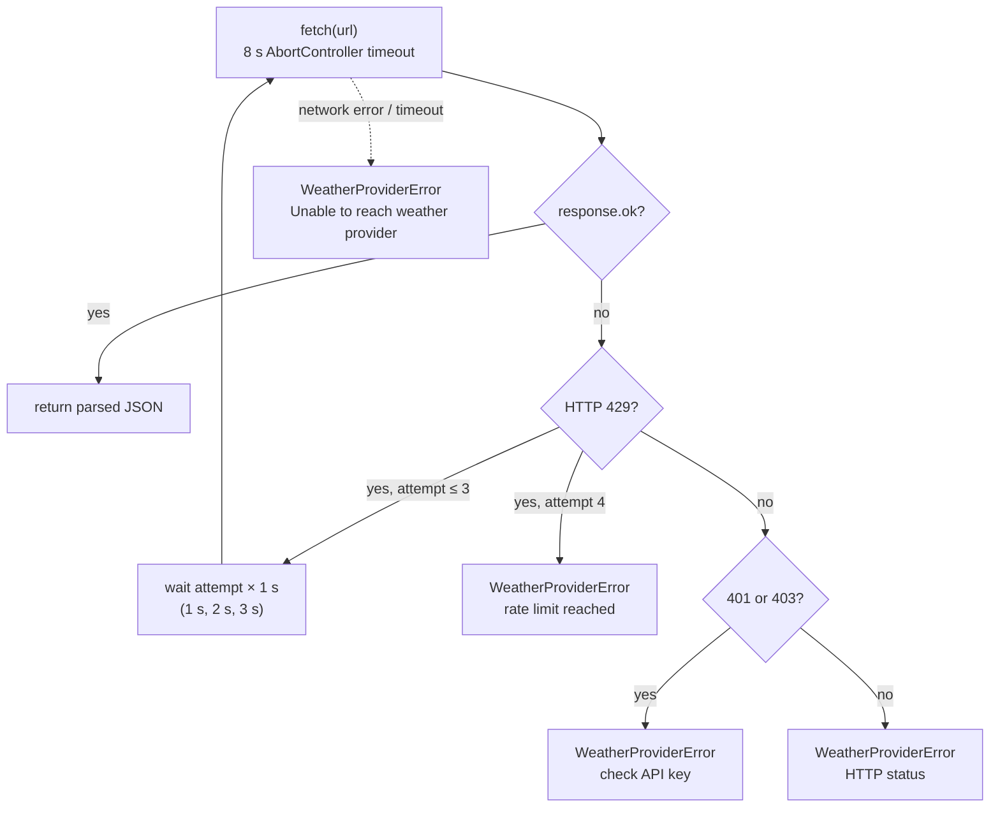

Weather is fetched from data.gov.sg in exactly two situations:

1. `POST /api/locations`: right after a new location row is inserted.
2. `POST /api/locations/:id/refresh`: when the user clicks **Refresh**.

Every other read comes from SQLite.

## Refresh sequence

The store ignores the refresh response body and reloads the whole list, so every card and the map stay consistent.

## Create sequence

## Upstream fan-out

`SingaporeWeatherClient.getCurrentWeather()` runs six groups at once with `Promise.all`. The five station endpoints run **one after another** inside their group to avoid HTTP 429 on the unauthenticated tier.

### Field mapping

| Snapshot field(s)                                                 | Endpoint                                | Selection                                                                                |
| ----------------------------------------------------------------- | --------------------------------------- | ---------------------------------------------------------------------------------------- |
| `condition`, `area`, `valid_period_text`, `observed_at`, `source` | `two-hr-forecast`                       | Nearest `area_metadata` label; falls back to the first forecast entry.                   |
| `forecast_low_c`, `forecast_high_c`                               | `twenty-four-hr-forecast`               | National `general.temperature` low/high.                                                 |
| `forecast_periods[]`                                              | `twenty-four-hr-forecast`               | Per period, the text for the nearest of five built-in regions (falls back to `central`). |
| `daily_forecast[]`                                                | `v1/environment/4-day-weather-forecast` | All days in the latest item.                                                             |
| `uv_index`                                                        | `uv`                                    | First (latest) hourly index value, nationwide.                                           |
| `psi_twenty_four_hourly`, `pm25_one_hourly`, `air_quality_region` | `psi`, `pm25`                           | Nearest region from the PSI response's `regionMetadata`.                                 |
| `temperature_c`                                                   | `air-temperature`                       | Nearest station that has a numeric reading.                                              |
| `humidity_percent`                                                | `relative-humidity`                     | Nearest station with a reading.                                                          |
| `rainfall_mm`                                                     | `rainfall`                              | Nearest station with a reading.                                                          |
| `wind_speed_knots`                                                | `wind-speed`                            | Nearest station with a reading. Stored in knots, shown in km/h.                          |
| `wind_direction_degrees`                                          | `wind-direction`                        | Nearest station with a reading.                                                          |

"Nearest" means the smallest squared difference in latitude and longitude, in degrees. That's accurate enough for comparisons across a city the size of Singapore.

## Retries and timeouts

Every request goes through the private `fetchJson()`:

Requests send `Accept: application/json`, a `User-Agent` of `weather-starter/0.1 (educational project)`, and `x-api-key` when `WEATHER_API_KEY` is set.

## Failure behaviour

Each fan-out group has its own `.catch()`, so one failing endpoint doesn't break the refresh. Its fields just come back empty.

| What fails                                                                  | Result                                                                                                                           |
| --------------------------------------------------------------------------- | -------------------------------------------------------------------------------------------------------------------------------- |
| Any station, UV, air-quality, 24-hour, or 4-day request                     | Those fields become `null` (or `[]`). The refresh still returns `200`.                                                           |
| The `two-hr-forecast` request itself                                        | Snapshot base becomes `condition: "Unavailable"` with no area. Still `200`.                                                      |
| `two-hr-forecast` returns a non-zero `code`, no items, or no area forecasts | `snapshotFromPayload()` throws `WeatherProviderError`. Refresh returns **502**. Create returns **201** with the unrefreshed row. |
| SQLite or other unexpected error                                            | Passed to Express's error handler, which returns **500**.                                                                        |
