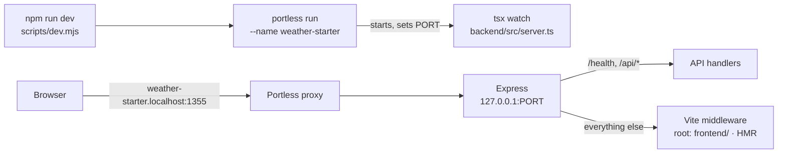
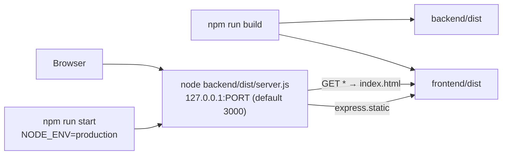
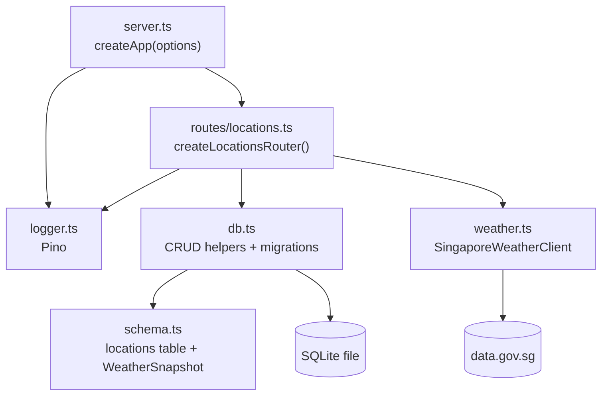
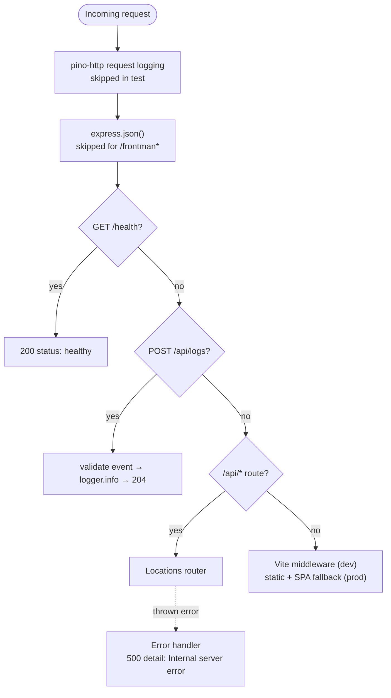
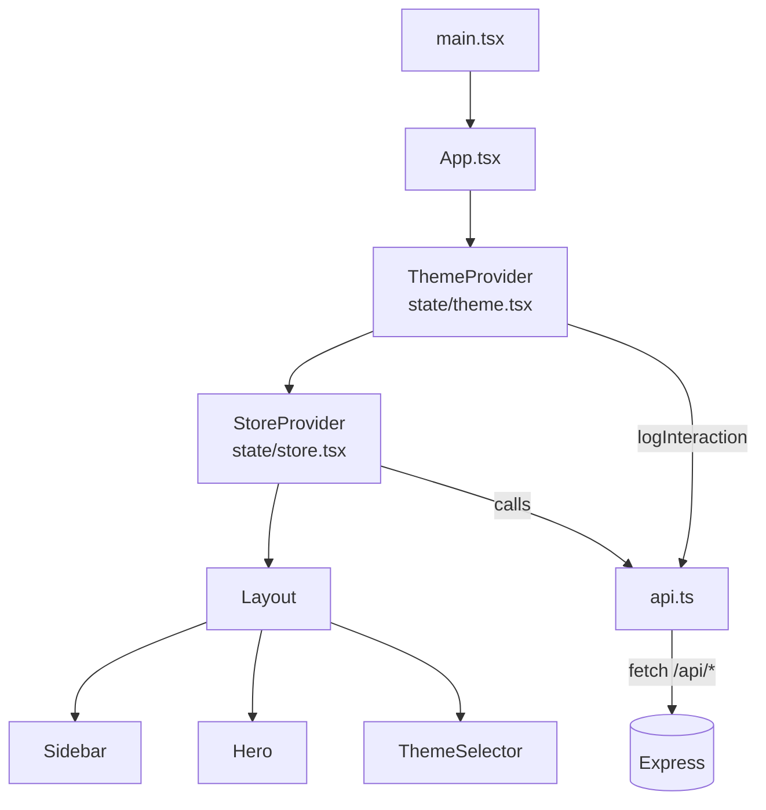

Weather Starter is a TypeScript monorepo with three npm workspaces:

| Workspace   | Stack                                                     | Output                               |
| ----------- | --------------------------------------------------------- | ------------------------------------ |
| `backend/`  | Node 24, Express 4, Drizzle ORM, `node:sqlite`, Pino      | `backend/dist` (compiled with `tsc`) |
| `frontend/` | React 18, Vite 7, Tailwind CSS 3, Leaflet / React Leaflet | `frontend/dist` (Vite build)         |
| `docs/`     | Astro + Starlight                                         | This site                            |

## Runtime modes

The backend and frontend always run as **one Node process**. What changes between modes is how the frontend reaches the browser.

### Development

- `createApp()` calls Vite's `createServer({ server: { middlewareMode: true }, appType: 'spa' })` and mounts `vite.middlewares`.
- `tsx watch` restarts the backend when backend files change, and Vite hot-reloads frontend changes.
- Dev-only frontend tooling: `react-grab` is loaded from `index.html` when `import.meta.env.DEV` is true, and `frontend/vite.config.ts` registers the `@frontman-ai/vite` plugin.

### Production

### Test

With `NODE_ENV=test` (set by `vitest.config.ts`), `createApp()` skips frontend serving and request logging, and the logger is silent. Tests also inject a stub weather client. See [Testing](/guides/testing/).

## Backend module map

| Module                | Responsibility                                                                                                         |
| --------------------- | ---------------------------------------------------------------------------------------------------------------------- |
| `server.ts`           | Builds the Express app, wires middleware, and starts listening when run directly.                                      |
| `routes/locations.ts` | Validates input, handles the location lifecycle, and maps errors to status codes.                                      |
| `weather.ts`          | Calls every data.gov.sg endpoint, picks the nearest station, area, or region, retries on 429, and builds the snapshot. |
| `db.ts`               | Opens SQLite, runs migrations when imported, and converts between table rows and API records.                          |
| `schema.ts`           | Drizzle table definition and the stored `WeatherSnapshot` type.                                                        |
| `logger.ts`           | Shared Pino logger writing to stdout and `backend/logs/app.log`.                                                       |

The router depends on a small `WeatherClient` interface (`getCurrentWeather(lat, lon)`) rather than on the concrete class, so tests can pass in a stub through `createApp({ weatherClient })`.

## Express request pipeline

Middleware is registered in this order in `createApp()`:

## Frontend layering

Components never call `fetch` directly. They use the store's actions, which call `api.ts`. More detail in [Frontend overview](/frontend/overview/).

## Key design decisions

| Decision                               | Why it matters                                                                                                        |
| -------------------------------------- | --------------------------------------------------------------------------------------------------------------------- |
| Single process for API and UI          | No CORS, no proxy config. The frontend uses relative `/api` URLs in every mode.                                       |
| Cache-first reads                      | Page loads never wait on data.gov.sg. Upstream calls happen only on create or refresh.                                |
| Latest snapshot only                   | Weather is stored in columns of the `locations` row and overwritten on refresh. Simple, but there's no history.       |
| Serialised station requests            | Keeps unauthenticated usage under data.gov.sg rate limits. See [Refresh data flow](/architecture/refresh-data-flow/). |
| Injected weather client                | API tests run fully offline against a real SQLite file.                                                               |
| Built-in `node:sqlite` + Drizzle proxy | No native SQLite dependency to compile. Needs Node 24 and suppresses its experimental warning.                        |
