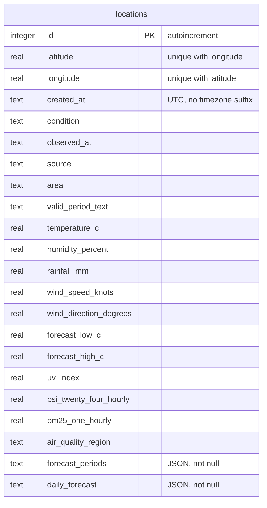
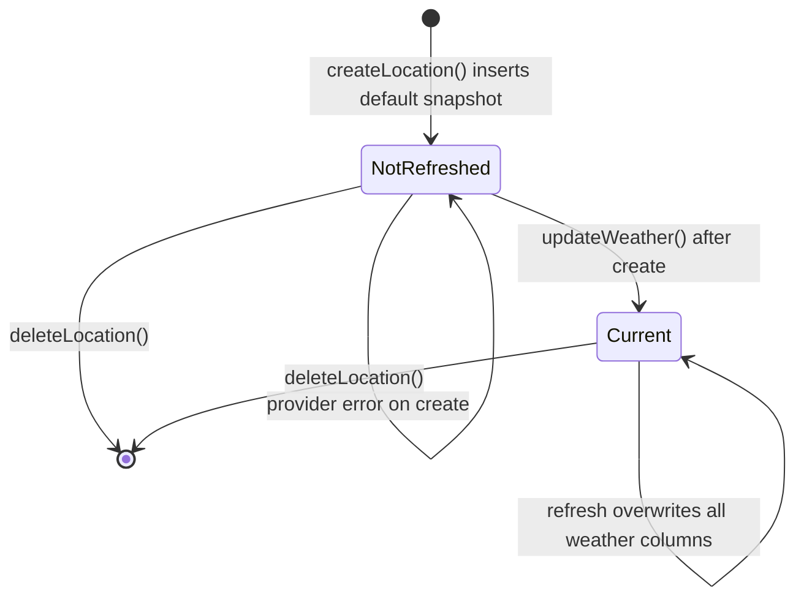

## Stack

- **Engine:** Node's built-in `node:sqlite` (`DatabaseSync`). No native module to install.
- **ORM:** Drizzle ORM through its `sqlite-proxy` driver. `db.ts` provides a `sqliteCallback` that runs Drizzle's SQL on the synchronous `DatabaseSync` handle.
- **Journal mode:** WAL (`PRAGMA journal_mode = WAL`), which is why `weather.db-shm` and `weather.db-wal` sit next to the database file.
- **File:** `DATABASE_PATH`, or `<cwd>/backend/weather.db`. The parent directory is created if it's missing.

## Schema

There is a single table. The weather snapshot is stored **in columns of the location row**: scalar metrics are typed columns, and the two forecast arrays are JSON text columns.



- Primary key: `id` (autoincrement).
- Unique index `locations_latitude_longitude_unique` on `(latitude, longitude)`. `createLocation()` also checks for duplicates first and throws `DuplicateLocationError`, which the router turns into a 409.
- `forecast_periods` and `daily_forecast` use Drizzle's `text(..., { mode: 'json' })`, so they're parsed and serialised automatically.

The table is defined in `backend/src/schema.ts`. The generated SQL is in `backend/drizzle/0000_dusty_gladiator.sql`.

## Snapshot lifecycle



A new row starts with the default snapshot: `condition: "Not refreshed"`, `source: "not-refreshed"`, every metric `null`, and empty arrays. `updateWeather()` writes every weather column in a single `UPDATE ... RETURNING`, so a location never ends up half-updated. Old values are replaced, not kept.

## Data access helpers (`db.ts`)

| Function                      | Behaviour                                                                                      |
| ----------------------------- | ---------------------------------------------------------------------------------------------- |
| `listLocations()`             | All rows as `LocationRecord`s, ordered by `created_at` desc, then `id` desc.                   |
| `createLocation(lat, lon)`    | Duplicate check, then insert with the default snapshot. Returns the new record.                |
| `getLocation(id)`             | Record or `null`.                                                                              |
| `updateWeather(id, snapshot)` | Overwrites the weather columns. Returns the updated record or `null`.                          |
| `deleteLocation(id)`          | `true` if a row was deleted, `false` if the id wasn't found.                                   |
| `resetStore()`                | Deletes all rows and resets the autoincrement counter. Not used by routes or tests at present. |

Two private mappers convert between API and table formats: `weatherToColumns()` (snake_case snapshot → camelCase Drizzle columns) and `rowToRecord()` (the reverse, nesting the fields under `weather`).

## Migrations

**Migrations run automatically.** When `db.ts` is first imported, it calls Drizzle's `migrate()` with `migrationsFolder: <cwd>/backend/drizzle` and executes each pending statement. Starting the server is enough to create or upgrade the schema.

To change the schema:

1. Edit the table in `backend/src/schema.ts`.
2. Update the snapshot type and mappers so they stay in sync (see below).
3. Run `npm run db:generate` to write a new SQL migration into `backend/drizzle/`.
4. Restart the server to apply it. `npm run db:migrate` applies migrations through drizzle-kit instead.

:::caution[Three copies of `WeatherSnapshot`]
The snapshot type is declared separately in `backend/src/schema.ts`, `backend/src/weather.ts`, and `frontend/src/types.ts`, and they differ slightly (`weather.ts` makes `condition`, `observed_at`, and `source` non-null). When you add a field, update all three, plus `defaultWeather`, `weatherToColumns()`, and `rowToRecord()` in `db.ts`.
:::

## Resetting local data

```bash
npm run reset
```

Deletes the database file and its `-shm` / `-wal` files. Stop the server first, then start it again to recreate an empty schema.
