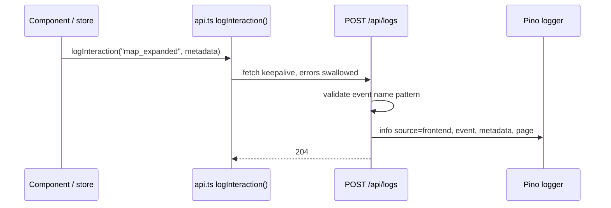

## `createApp(options)`

`backend/src/server.ts` exports an async factory that builds and returns an Express app without starting it:

```ts
interface AppOptions {
  serveFrontend?: boolean; // default: NODE_ENV !== 'test'
  enableRequestLogging?: boolean; // default: NODE_ENV !== 'test'
  weatherClient?: WeatherClient; // default: new SingaporeWeatherClient(...)
}
```

It's async because development mode imports Vite and creates its dev server with `await`.

When the file is run directly (`tsx watch backend/src/server.ts` or `node backend/dist/server.js`), it calls `createApp()` and listens on `127.0.0.1:${PORT ?? 3000}`.

## Frontend serving

| Condition                   | Behaviour                                                                  |
| --------------------------- | -------------------------------------------------------------------------- |
| `serveFrontend` is `false`  | API only.                                                                  |
| `NODE_ENV === 'production'` | `express.static(frontend/dist)` plus `GET *` → `frontend/dist/index.html`. |
| Anything else               | Vite dev server in middleware mode (`root: frontend/`, `appType: 'spa'`).  |

These paths are resolved relative to the compiled file (`__dirname/../../frontend`), so they work from both `src/` and `dist/`.

## Request pipeline

1. `pino-http` request logging, when enabled.
2. JSON body parsing on every path **except** those starting with `/frontman`, which the Frontman Vite plugin handles itself.
3. `GET /health`.
4. `POST /api/logs`.
5. The locations router under `/api`.
6. Frontend serving (see above).
7. Error handler: logs `request failed` at `error` level and returns **500** `{ "detail": "Internal server error" }`.

Route handlers wrap their work in `try/catch` and send unexpected errors to `next(error)`. Handled errors (validation, not found, duplicates, provider failures) return `{ detail }` directly.

## Logger

`backend/src/logger.ts` exports one shared Pino instance:

- **Level:** `LOG_LEVEL`, or `silent` under `NODE_ENV=test`, otherwise `info`.
- **Base fields:** every line includes `service: "weather-starter"`.
- **Destinations (outside tests):** a Pino multistream writing to stdout **and** asynchronously to `LOG_FILE_PATH` (default `<cwd>/backend/logs/app.log`). The log directory is created on startup.

Notable log events:

| Message                                        | Level | Emitted by                          |
| ---------------------------------------------- | ----- | ----------------------------------- |
| `Weather Starter listening`                    | info  | `server.ts` on startup (with `url`) |
| `frontend interaction`                         | info  | `POST /api/logs`                    |
| `location deleted`                             | info  | `DELETE` handler                    |
| `duplicate location rejected`                  | warn  | `POST /api/locations`               |
| `weather refresh failed after location create` | warn  | `POST /api/locations`               |
| `request failed`                               | error | Express error handler               |

Plus one `pino-http` line per request when request logging is on.

## Frontend interaction logging



`logInteraction` never throws and nothing waits for it. `keepalive: true` lets the request finish even if the page is navigating away.
