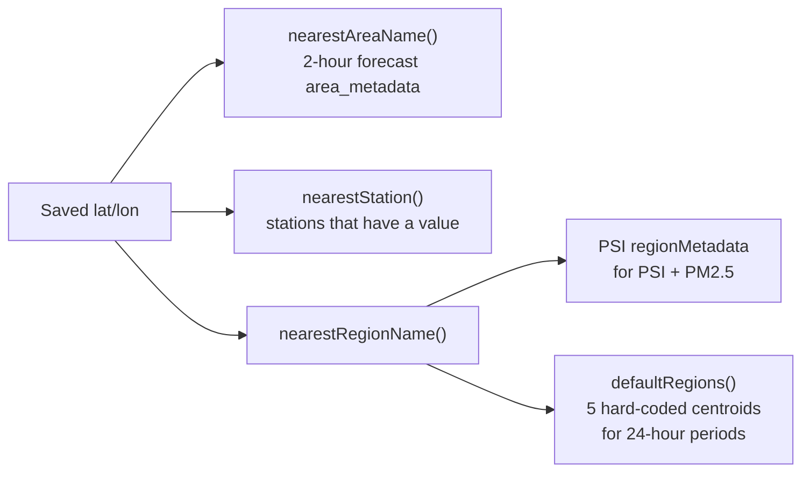

`backend/src/weather.ts` exports `SingaporeWeatherClient`, `WeatherProviderError`, and the `WeatherSnapshot`, `ForecastPeriod`, and `DailyForecast` types. It is the only code that makes outbound HTTP requests.

## Construction

```ts
new SingaporeWeatherClient({
  baseUrl?: string;   // default https://api-open.data.gov.sg (v2 endpoints only)
  apiKey?: string;    // sent as x-api-key
  timeoutMs?: number; // default 8000 per request
  userAgent?: string; // default "weather-starter/0.1 (educational project)"
});
```

The locations router creates one with only `apiKey: process.env.WEATHER_API_KEY`, unless `createApp()` was given a `weatherClient`. The 4-day forecast always uses the legacy host `https://api.data.gov.sg`, whatever `baseUrl` is set to.

## The `WeatherClient` seam

The router only depends on this interface, defined in `routes/locations.ts`:

```ts
export interface WeatherClient {
  getCurrentWeather(latitude: number, longitude: number): Promise<WeatherSnapshot>;
}
```

Any object with this method can be passed to `createApp({ weatherClient })`. The API tests pass a `vi.fn()` stub.

## Public methods

| Method                                    | Endpoint(s)                                  | Returns                                                  |
| ----------------------------------------- | -------------------------------------------- | -------------------------------------------------------- |
| `getCurrentWeather(lat, lon)`             | All of the below                             | A complete `WeatherSnapshot`                             |
| `fetchLatestForecastPayload()`            | `/v2/real-time/api/two-hr-forecast`          | Raw 2-hour forecast payload                              |
| `snapshotFromPayload(payload, lat, lon)`  | —                                            | Base snapshot with condition, area, and period filled in |
| `fetchNearestReading(endpoint, lat, lon)` | `/v2/real-time/api/{endpoint}`               | `{ value, timestamp }` for the nearest station           |
| `fetchReadingPayload(endpoint)`           | `/v2/real-time/api/{endpoint}`               | Raw station reading payload                              |
| `fetchUvIndex()`                          | `/v2/real-time/api/uv`                       | `{ value, timestamp }`                                   |
| `fetchAirQuality(lat, lon)`               | `/v2/real-time/api/psi` + `/pm25` (parallel) | `{ psi, pm25, region, timestamp }`                       |
| `fetchTwentyFourHourForecast(lat, lon)`   | `/v2/real-time/api/twenty-four-hr-forecast`  | `{ low, high, periods, timestamp }`                      |
| `fetchFourDayForecast()`                  | `/v1/environment/4-day-weather-forecast`     | `{ days, timestamp }`                                    |

Station endpoints accepted by `fetchNearestReading`: `air-temperature`, `relative-humidity`, `rainfall`, `wind-speed`, `wind-direction`.

## Location matching

The client uses three different "nearest" strategies, depending on what the upstream payload provides:



- **Areas.** If the nearest area has no forecast in the latest item, the client uses the first forecast in the list instead.
- **Stations.** Stations with no numeric reading are skipped, so a location never picks a closer station that has no data.
- **Regions.** The 24-hour forecast payload doesn't include region coordinates, so the client uses built-in centroids for `west`, `north`, `central`, `south`, and `east`. If the chosen region has no text for a period, it uses `central`.

Distance is the squared difference in degrees, `(Δlat)² + (Δlon)²`. Nothing is converted to kilometres.

## Payload validation

v2 payloads carry a `code` field. When `code` is present and not `0`, the method throws `WeatherProviderError` with `errorMsg`. The v1 4-day payload has no `code`, so it isn't checked. Numeric strings are converted with `Number()`, and anything that isn't a number becomes `null`.

## Errors

Every error this client raises is a `WeatherProviderError`:

| Cause                           | Message                                             |
| ------------------------------- | --------------------------------------------------- |
| HTTP 429 after 3 retries        | `Weather provider rate limit reached (HTTP 429)`    |
| HTTP 401 / 403                  | `Weather provider rejected request (check API key)` |
| Other non-2xx                   | `Weather provider returned HTTP <status>`           |
| Network failure or 8 s timeout  | `Unable to reach weather provider`                  |
| v2 payload with non-zero `code` | Upstream `errorMsg` or an endpoint-specific message |
| 2-hour forecast with no items   | `Forecast response has no items`                    |
| 2-hour forecast with no areas   | `Forecast item has no area forecasts`               |

Inside `getCurrentWeather()` most of these errors are caught and turned into `null` fields. See [failure behaviour](/architecture/refresh-data-flow/#failure-behaviour) for which errors reach the API response.
