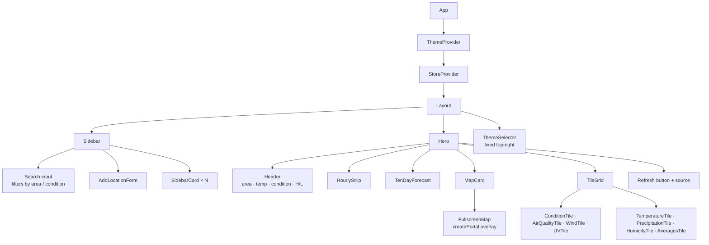

The frontend is a single-page React 18 app in `frontend/`, built with Vite 7 and styled with Tailwind CSS 3. It has no router: one dashboard view shows whichever location is selected.

## Entry point

- `index.html` mounts `#root` and, in development only, dynamically imports `react-grab`.
- `src/main.tsx` renders `<App />` inside `React.StrictMode` and imports `index.css` (Tailwind layers plus theme overrides).
- `src/App.tsx` nests providers in this order: `ThemeProvider` → `StoreProvider` → `Layout`.

## Component tree

See [Components](/frontend/components/) for what each one renders.

## Source layout

| Path                  | Purpose                                                              |
| --------------------- | -------------------------------------------------------------------- |
| `src/main.tsx`        | React root                                                           |
| `src/App.tsx`         | Provider composition                                                 |
| `src/api.ts`          | `fetch` wrappers for `/api/*` and `logInteraction`                   |
| `src/types.ts`        | `Location`, `WeatherSnapshot`, `StoreValue`, `ThemeValue`, and more  |
| `src/state/store.tsx` | Locations store (`StoreProvider`, `useStore`, `useSelectedLocation`) |
| `src/state/theme.tsx` | Theme registry and provider (`THEMES`, `ThemeProvider`, `useTheme`)  |
| `src/components/`     | UI components, icons, and formatting helpers                         |
| `src/index.css`       | Tailwind directives, base background, per-theme CSS overrides        |

## API client (`api.ts`)

All requests go to the relative base `/api`.

| Function                          | Request                            | Resolves to                 |
| --------------------------------- | ---------------------------------- | --------------------------- |
| `listLocations()`                 | `GET /api/locations`               | `{ locations: Location[] }` |
| `createLocation(payload)`         | `POST /api/locations`              | `Location`                  |
| `refreshLocation(id)`             | `POST /api/locations/:id/refresh`  | `Location`                  |
| `deleteLocation(id)`              | `DELETE /api/locations/:id`        | `null`                      |
| `logInteraction(event, metadata)` | `POST /api/logs` (fire-and-forget) | `void`                      |

The shared `request<T>()` helper:

- sends `Content-Type: application/json`
- on a non-2xx response, throws `Error(detail)` using the server's `{ detail }` body, or `"Request failed"` if there isn't one
- returns `null` for `204 No Content`

## Dev tooling hooks

- `@frontman-ai/vite` is registered in `vite.config.ts`, and the backend's JSON parser skips `/frontman*` requests so the plugin can handle them.
- `react-grab` is imported only when `import.meta.env.DEV` is true.
