App state lives in `src/state/store.tsx`, a React Context provider built on `useState`. There's no external state library.

## Store shape

`useStore()` returns a `StoreValue`:

| Field / action    | Type                           | Meaning                                                          |
| ----------------- | ------------------------------ | ---------------------------------------------------------------- |
| `locations`       | `Location[]`                   | Latest list from `GET /api/locations` (newest first)             |
| `selectedId`      | `number \| null`               | Selected location, after the fallback rule below                 |
| `isAdding`        | `boolean`                      | Whether `AddLocationForm` is open                                |
| `isLoading`       | `boolean`                      | `true` until the first list load finishes                        |
| `refreshingId`    | `number \| null`               | Location currently refreshing (drives the spinner)               |
| `deletingId`      | `number \| null`               | Location currently being deleted                                 |
| `error`           | `unknown`                      | Last error from load, create, refresh, or delete                 |
| `select(id)`      | `(id: number \| null) => void` | Change the selection                                             |
| `setAdding(open)` | `(open: boolean) => void`      | Open or close the add form. Opening logs `location_form_opened`. |
| `create(payload)` | `Promise<void>`                | Create a location. **Re-throws** on failure.                     |
| `refresh(id)`     | `Promise<void>`                | Refresh one location. Errors go to `error`.                      |
| `remove(id)`      | `Promise<void>`                | Delete one location. Errors go to `error`.                       |

`useSelectedLocation()` is a helper that returns the `Location` matching `selectedId`, or `null`.

## Selection rules

- On mount the store loads the list and selects the first location (the newest) if nothing is selected.
- `selectedId` is **derived**: if the stored id isn't in `locations`, the first location is used instead. If the list is empty, it's `null`.
- After `create`, the new location is selected.
- After `remove`, if the deleted location was selected, the first remaining location is selected.
- The sidebar card, the map pin highlight, and the `Hero` all read the same `selectedId`, so they stay in sync.

"Home" (shown by `SidebarCard` and `Hero`) is simply `locations[0]`. Because the list is sorted newest first, that's the **most recently added** location.

## Action flows

```mermaid
flowchart TD
  subgraph create["create(payload)"]
    C1["log location_create_submitted"] --> C2["POST /api/locations"]
    C2 -- ok --> C3["load() → GET /api/locations"]
    C3 --> C4["select created id<br/>close form<br/>log location_created"]
    C2 -- error --> C5["set error<br/>log location_create_failed<br/>re-throw to form"]
  end

  subgraph refresh["refresh(id)"]
    R1["refreshingId = id<br/>log location_refresh_clicked"] --> R2["POST /api/locations/:id/refresh"]
    R2 -- ok --> R3["load()<br/>log location_refreshed"]
    R2 -- error --> R4["set error<br/>log location_refresh_failed"]
    R3 --> R5["refreshingId = null"]
    R4 --> R5
  end

  subgraph remove["remove(id)"]
    D1["deletingId = id<br/>log location_delete_clicked"] --> D2["DELETE /api/locations/:id"]
    D2 -- ok --> D3["filter id out of local list<br/>move selection if needed<br/>log location_deleted"]
    D2 -- error --> D4["set error<br/>log location_delete_failed"]
    D3 --> D5["deletingId = null"]
    D4 --> D5
  end
```

Notes:

- `create` and `refresh` reload the full list after the mutation instead of merging the response into state.
- `remove` waits for the server to confirm before removing the location from local state. It is **not** optimistic, and it doesn't reload the list afterwards.
- Only `create` failures reach the UI, through `AddLocationForm`'s inline message. Refresh and delete errors are stored in `error`, but no component currently displays it.

## Theme state

The theme lives in its own provider, `src/state/theme.tsx`. See [Themes](/frontend/themes/).
