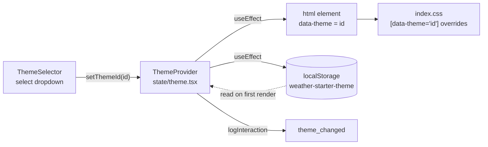

Themes change the look of the dashboard without touching any component. A theme is a registry entry plus a block of scoped CSS.

## How it works



1. `THEMES` in `state/theme.tsx` lists the available themes as `{ id, name }`.
2. On first render, `ThemeProvider` reads `localStorage['weather-starter-theme']` and uses it only if it matches a registered id. Otherwise it uses the first theme.
3. Whenever the theme changes, the provider sets `document.documentElement.dataset.theme` and saves the id to `localStorage`.
4. `frontend/src/index.css` has a `[data-theme='…']` block for each non-default theme. These blocks override the page background and specific Tailwind utility classes (for example `.text-white`, `.bg-white\/20`, `.tracking-\[0\.14em\]`).

The default `apple` look is the base styling in `index.css` plus the Tailwind classes in the components, so it needs no override block.

## Registered themes

| id             | Name         | Character                                                                         |
| -------------- | ------------ | --------------------------------------------------------------------------------- |
| `apple`        | Apple        | Default. Slate-blue gradient with frosted white glass cards.                      |
| `aurora-glass` | Aurora Glass | Deep indigo night sky with aurora glows, wider label letter-spacing, sky accents. |
| `nordic-frost` | Nordic Frost | Light ice-blue gradient with dark slate text. Reverses the white-on-dark classes. |

`THEMES.md` in the repository root has full specs for these themes and for planned ones (`sunset-dusk`, `golden-hour`, `ocean-depth`, `monsoon`, `desert-sand`, `neon-city`, `cherry-blossom`, `volcanic`).

## Adding a theme

1. Add an entry to `THEMES` in `frontend/src/state/theme.tsx`:

   ```ts
   { id: 'ocean-depth', name: 'Ocean Depth' },
   ```

2. Add a scoped block to `frontend/src/index.css`:

   ```css
   [data-theme='ocean-depth'] body {
     background: linear-gradient(170deg, #0b3d5c 0%, #062437 100%);
   }
   ```

3. Override any utility classes whose colours don't suit the new background. Light themes need to override the `text-white/*`, `bg-white/*`, and `border-white/*` classes, as `nordic-frost` does.

:::tip
Overrides target Tailwind class names, so they only take effect for classes that appear in the source and are therefore generated. If a component starts using a new utility class, check every theme that overrides similar classes.
:::
