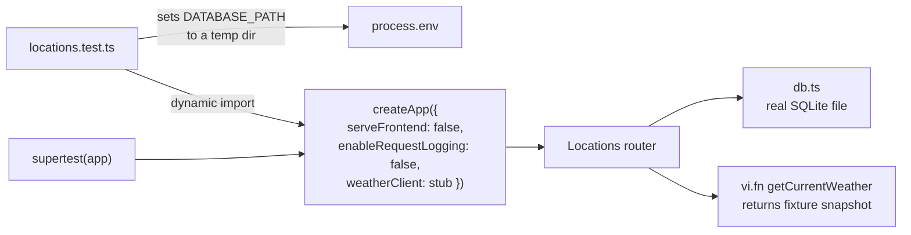

## Running tests

```bash
npm test             # vitest run (single pass)
npm run test:watch   # vitest in watch mode
```

Both run from the root with `NODE_OPTIONS=--disable-warning=ExperimentalWarning` (set through `cross-env`). The Husky pre-commit hook runs `npm test` after `npm run lint`.

## Configuration

`vitest.config.ts`:

| Setting           | Value                               | Why                                                          |
| ----------------- | ----------------------------------- | ------------------------------------------------------------ |
| `environment`     | `node`                              | Backend only                                                 |
| `include`         | `backend/src/**/*.test.ts`          | There are no frontend tests at present                       |
| `pool`            | `forks`                             | Each test file gets its own process                          |
| `fileParallelism` | `false`                             | Test files run one at a time, which avoids SQLite contention |
| `env`             | `NODE_ENV=test`, `LOG_LEVEL=silent` | Turns off Vite, request logging, and log output              |

## How the tests are wired



- `server.js` is imported **after** `DATABASE_PATH` is set, because `db.ts` opens the database and runs migrations as soon as it's imported.
- The weather client is a `vi.fn()` that returns a fixture `WeatherSnapshot`. Individual tests use `mockResolvedValueOnce` / `mockRejectedValueOnce` to simulate a refreshed snapshot or a `WeatherProviderError`.
- Temp directories are removed in `afterAll`. `EBUSY` errors are ignored because `node:sqlite` keeps WAL files open on Windows.

:::note
`db.ts` keeps one database connection per process. Within `locations.test.ts`, the first `describe` that imports `server.js` decides which temp database is used, and later `describe` blocks share it even though they set a new `DATABASE_PATH`. Tests pick distinct coordinates, so the shared database doesn't cause conflicts.
:::

## Coverage

All in `backend/src/routes/locations.test.ts`:

| Endpoint                          | Cases                                                                                                                                              |
| --------------------------------- | -------------------------------------------------------------------------------------------------------------------------------------------------- |
| `GET /health`                     | Returns `{ status: "healthy" }`                                                                                                                    |
| `POST /api/logs`                  | Valid event → 204. Missing event → 422. Event fails the pattern → 422. No metadata → 204.                                                          |
| `POST /api/locations`             | Creates and fetches weather. Missing, non-numeric, or out-of-bounds coordinates → 422. Duplicate → 409. Provider error → 201 with "Not refreshed". |
| `GET /api/locations`              | Returns a list of records with weather                                                                                                             |
| `GET /api/locations/:id`          | Found. 404. Non-numeric → 422.                                                                                                                     |
| `POST /api/locations/:id/refresh` | Updates the snapshot. 404. Non-numeric → 422. Provider error → 502.                                                                                |
| `DELETE /api/locations/:id`       | 204, then GET → 404. Unknown → 404. Non-numeric → 422.                                                                                             |

Not covered: `SingaporeWeatherClient` parsing and retry logic, and anything in the frontend.

## Writing a new API test

```ts
import request from 'supertest';

it('returns 404 for an unknown id', async () => {
  const response = await request(app).get('/api/locations/99999').expect(404);
  expect(response.body.detail).toBeDefined();
});
```

Use coordinates no other test uses, since the unique index on `(latitude, longitude)` applies across the shared database.
