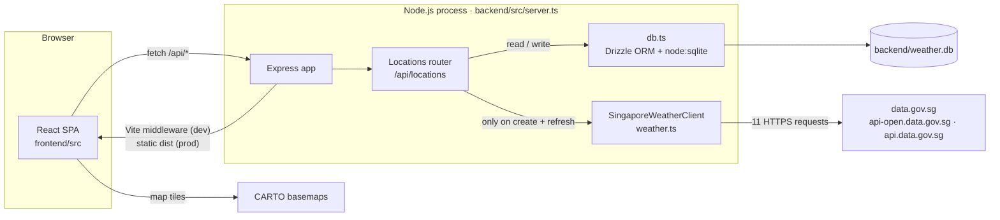

import { CardGrid, LinkCard } from '@astrojs/starlight/components';

Weather Starter is a full-stack Singapore weather dashboard. You save coordinates inside Singapore; the backend pulls live readings and forecasts from [data.gov.sg](https://data.gov.sg), stores the latest snapshot for each location in SQLite, and a React UI renders it as an Apple Weather–style dashboard with a map, forecast strips, and metric tiles.

## System architecture

Three ideas shape the whole codebase:

- **One process.** Express serves the JSON API _and_ the frontend. In development the React app is served through Vite middleware; in production Express serves `frontend/dist` statically. The frontend always calls relative `/api` URLs.
- **Read from cache, write on demand.** `GET` requests only read SQLite. data.gov.sg is contacted only when a location is created or explicitly refreshed.
- **One snapshot per location.** Each refresh overwrites the weather columns of the location's single row in one `UPDATE`. There is no history.

## Explore the docs

<CardGrid>
  <LinkCard
    title="Quickstart"
    description="Install, run the dev server, and add your first location."
    href="/getting-started/quickstart/"
  />
  <LinkCard
    title="System overview"
    description="Runtime modes, module boundaries, and request pipeline."
    href="/architecture/system-overview/"
  />
  <LinkCard
    title="Refresh data flow"
    description="How a refresh fans out to data.gov.sg and lands in SQLite."
    href="/architecture/refresh-data-flow/"
  />
  <LinkCard
    title="HTTP API"
    description="Every endpoint, payload, and status code."
    href="/backend/http-api/"
  />
  <LinkCard
    title="Frontend overview"
    description="Component tree, providers, and the API client."
    href="/frontend/overview/"
  />
  <LinkCard
    title="Caveats & known gaps"
    description="Sharp edges found while reading the source."
    href="/guides/known-gaps/"
  />
</CardGrid>
